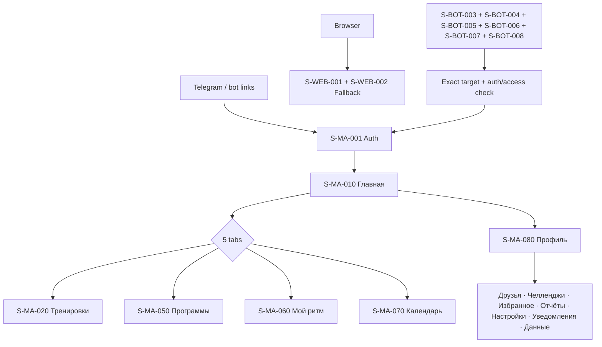

# IA overview

> Trace: §9–10, §36, DEC-013.
> Rendered node IDs: `S-BOT-003`, `S-BOT-004`, `S-BOT-005`, `S-BOT-006`, `S-BOT-007`, `S-BOT-008`, `S-MA-001`, `S-MA-010`, `S-MA-020`, `S-MA-050`, `S-MA-060`, `S-MA-070`, `S-MA-080`, `S-WEB-001`, `S-WEB-002`.

Ошибки не скрывают введённые данные; back/cancel не выполняет mutation; restricted targets повторно проверяют auth/permission. Общие состояния и accessibility: [`../screen-inventory.md`](../screen-inventory.md).
