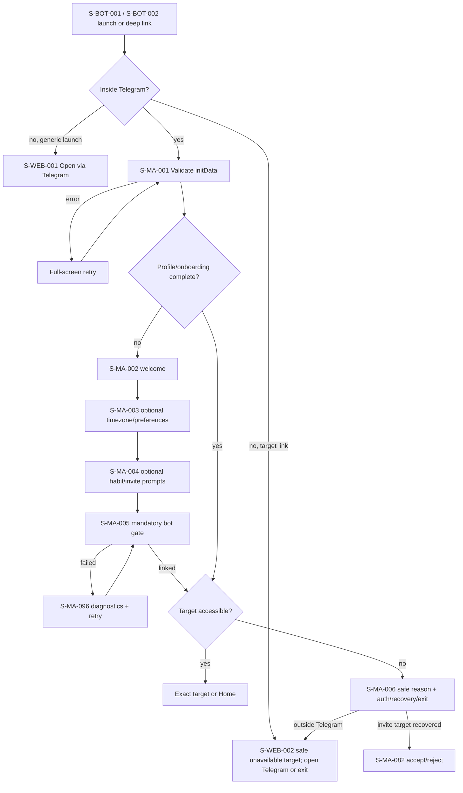

# F01 — onboarding, auth and recovery

> Trace: §10, §32, §36; DEC-013–014.
> Canonical screen IDs: `S-MA-001`, `S-MA-002`, `S-MA-003`, `S-MA-004`, `S-MA-005`, `S-MA-006`, `S-MA-082`, `S-MA-096`, `S-BOT-001`, `S-BOT-002`, `S-WEB-001`, `S-WEB-002`.
> Rendered node IDs: `S-BOT-001`, `S-BOT-002`, `S-MA-001`, `S-MA-002`, `S-MA-003`, `S-MA-004`, `S-MA-005`, `S-MA-006`, `S-MA-082`, `S-MA-096`, `S-WEB-001`, `S-WEB-002`.

Errors preserve entered data; back/cancel performs no mutation. Auth and permission are rechecked before rendering target data; unavailable/expired/revoked targets use `S-WEB-002` or `S-MA-006` without disclosure. Common states and accessibility: [`../screen-inventory.md`](../screen-inventory.md).
