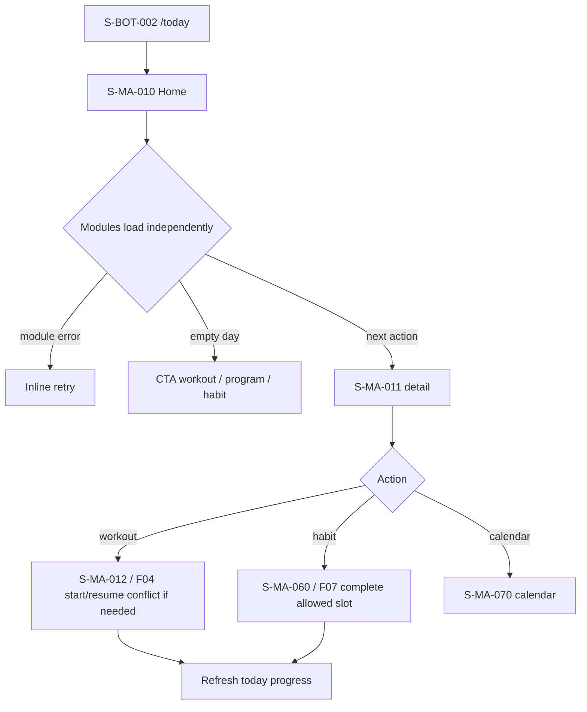

# F02 — Home and today

> Trace: §11, §14, §21, §28; DEC-016.
> Canonical screen IDs: `S-MA-010`, `S-MA-011`, `S-MA-012`, `S-MA-060`, `S-MA-070`, `S-BOT-002`.
> Rendered node IDs: `S-BOT-002`, `S-MA-010`, `S-MA-011`, `S-MA-012`, `S-MA-060`, `S-MA-070`.

Ошибки не скрывают введённые данные; back/cancel не выполняет mutation; restricted targets повторно проверяют auth/permission. Общие состояния и accessibility: [`../screen-inventory.md`](../screen-inventory.md).
