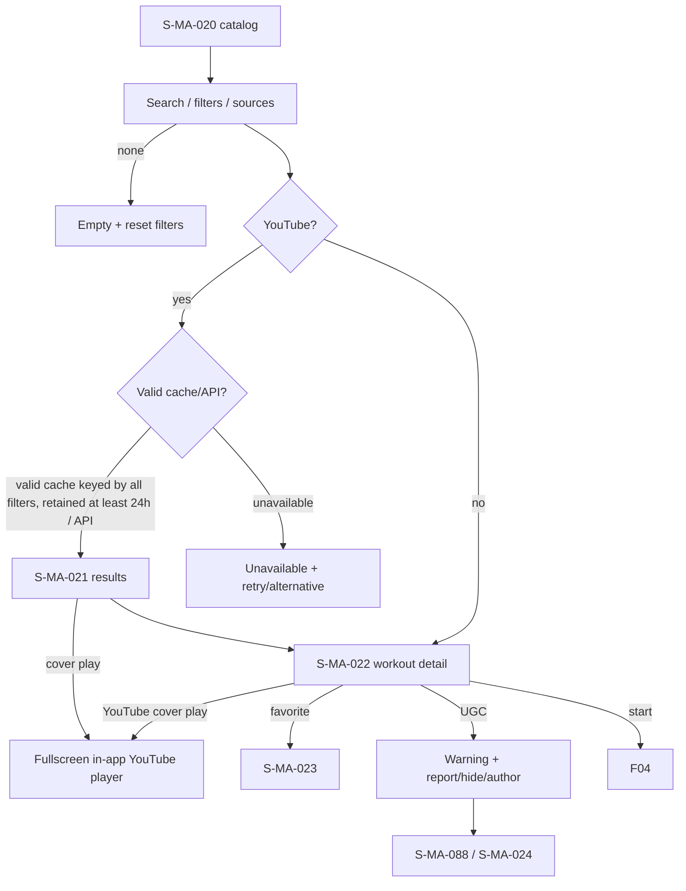

# F03 — yoga discovery

> Trace: §12–13, §18–19; DEC-016, DEC-021.
> Canonical screen IDs: `S-MA-020`, `S-MA-021`, `S-MA-022`, `S-MA-023`, `S-MA-024`, `S-MA-088`.
> Rendered node IDs: `S-MA-020`, `S-MA-021`, `S-MA-022`, `S-MA-023`, `S-MA-024`, `S-MA-088`.

Ошибки не скрывают введённые данные; back/cancel не выполняет mutation; restricted targets повторно проверяют auth/permission. Общие состояния и accessibility: [`../screen-inventory.md`](../screen-inventory.md).
