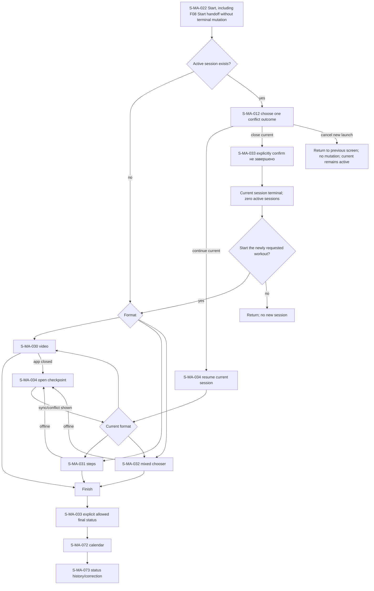

# F04 — workout execution

> Trace: §14–15, §26; DEC-015–016, DEC-062.
> Canonical screen IDs: `S-MA-012`, `S-MA-022`, `S-MA-030`, `S-MA-031`, `S-MA-032`, `S-MA-033`, `S-MA-034`, `S-MA-072`, `S-MA-073`.
> Rendered node IDs: `S-MA-012`, `S-MA-022`, `S-MA-030`, `S-MA-031`, `S-MA-032`, `S-MA-033`, `S-MA-034`, `S-MA-072`, `S-MA-073`.

Only `M` may create a new session, and it is reachable only with zero active sessions. Continue keeps the current session; close requires explicit `не завершено`; cancel-new performs no mutation. Back/app-close preserves the open checkpoint until explicit closure. DEC-062 maps video runtime to `/sessions/[id]`, real IFrame API active-time, 15-second server + monotonic local checkpoint, independent YouTube playback-position restore, `<1s` auto-server/`>=1s` explicit server-device conflict and atomic occurrence/history finish. Common states and accessibility: [`../screen-inventory.md`](../screen-inventory.md).
