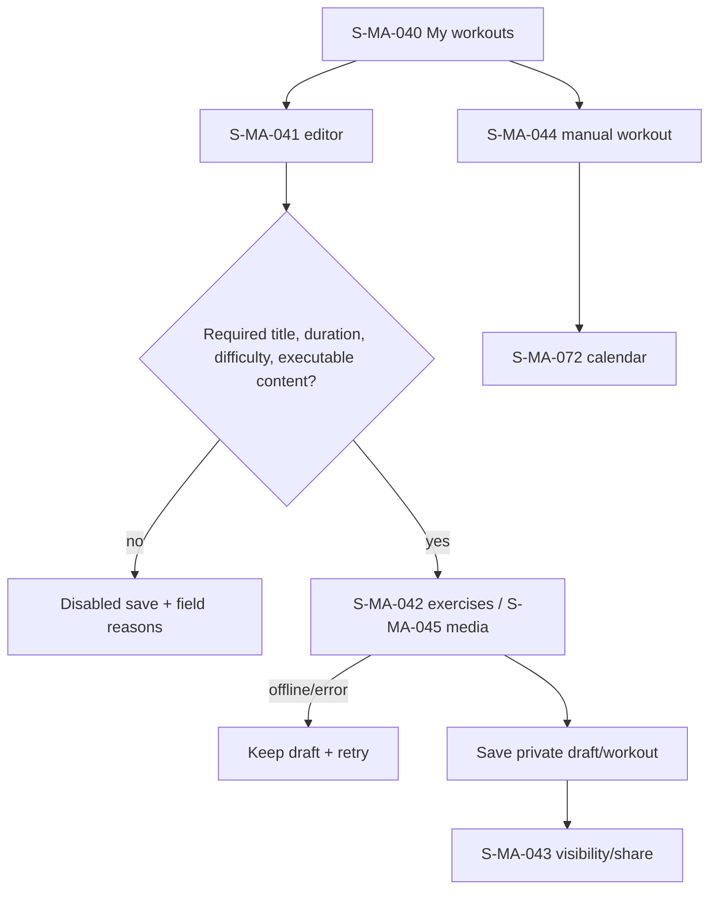

# F05 — own and manual workouts

> Trace: §16–17, §40; DEC-016.
> Canonical screen IDs: `S-MA-021`, `S-MA-040`, `S-MA-041`, `S-MA-042`, `S-MA-043`, `S-MA-044`, `S-MA-045`, `S-MA-072`.
> Rendered node IDs: `S-MA-040`, `S-MA-041`, `S-MA-042`, `S-MA-043`, `S-MA-044`, `S-MA-045`, `S-MA-072`.

Ошибки не скрывают введённые данные; back/cancel не выполняет mutation; restricted targets повторно проверяют auth/permission. Общие состояния и accessibility: [`../screen-inventory.md`](../screen-inventory.md).
