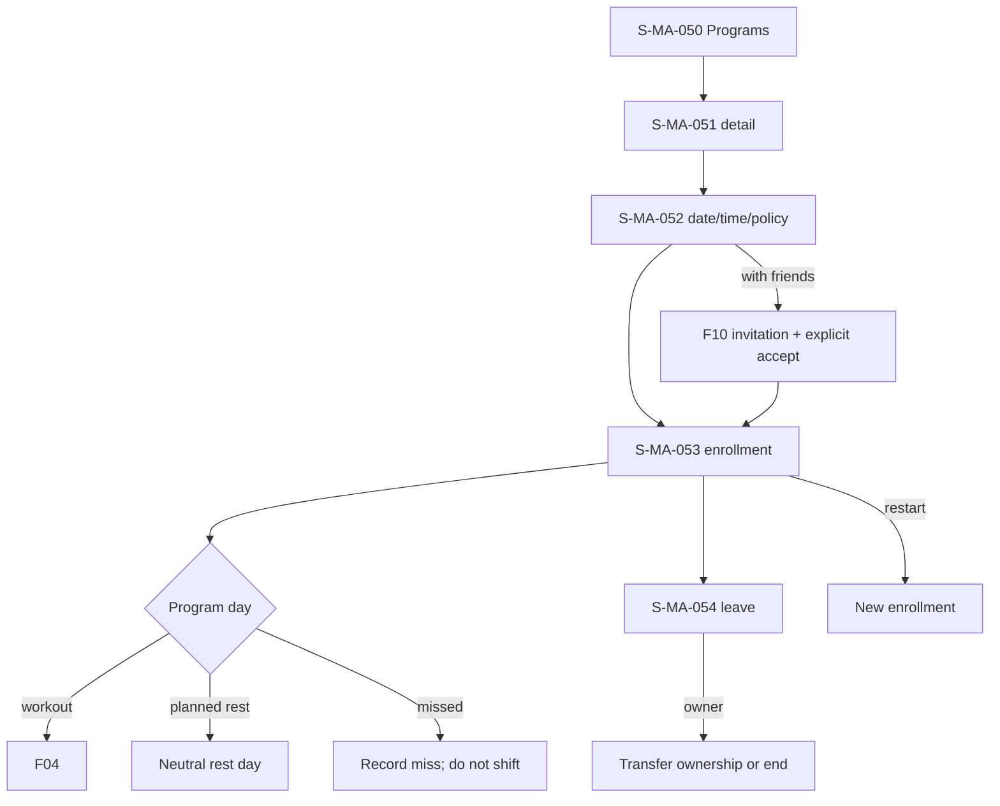

# F06 — programs

> Trace: §20; DEC-016, DEC-019–020.
> Canonical screen IDs: `S-MA-023`, `S-MA-050`, `S-MA-051`, `S-MA-052`, `S-MA-053`, `S-MA-054`, `S-MA-087`.
> Rendered node IDs: `S-MA-050`, `S-MA-051`, `S-MA-052`, `S-MA-053`, `S-MA-054`.

Ошибки не скрывают введённые данные; back/cancel не выполняет mutation; restricted targets повторно проверяют auth/permission. Общие состояния и accessibility: [`../screen-inventory.md`](../screen-inventory.md).
