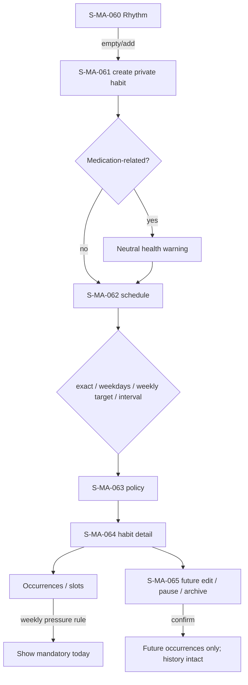

# F07 — habits and schedules

> Trace: §21–24, §27, §29, §39; DEC-017.
> Canonical screen IDs: `S-MA-011`, `S-MA-060`, `S-MA-061`, `S-MA-062`, `S-MA-063`, `S-MA-064`, `S-MA-065`.
> Rendered node IDs: `S-MA-060`, `S-MA-061`, `S-MA-062`, `S-MA-063`, `S-MA-064`, `S-MA-065`.

Ошибки не скрывают введённые данные; back/cancel не выполняет mutation; restricted targets повторно проверяют auth/permission. Общие состояния и accessibility: [`../screen-inventory.md`](../screen-inventory.md).
