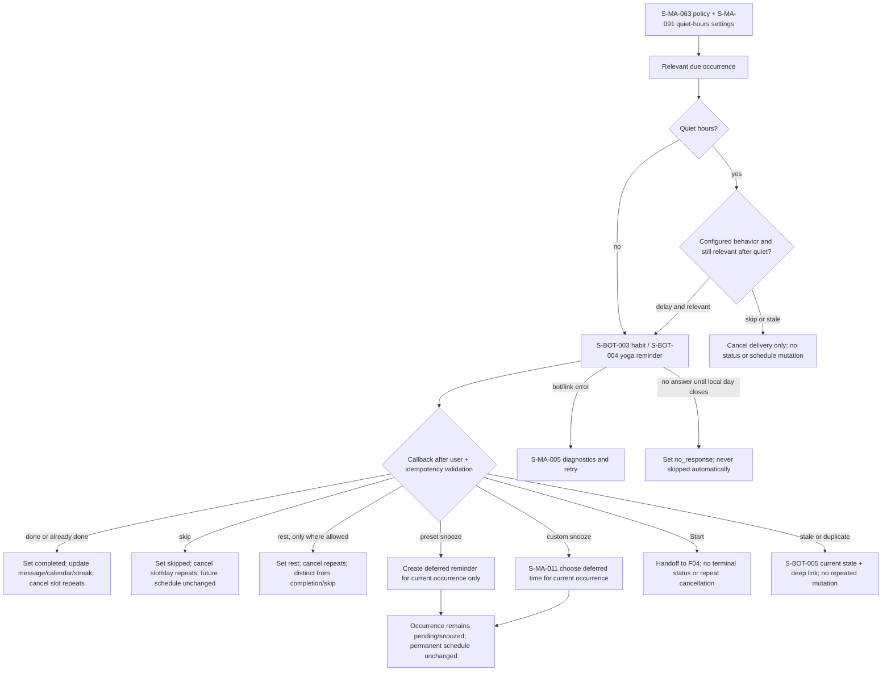

# F08 — reminders and Telegram

> Trace: §24–26, §36–37; DEC-014–015.
> Canonical screen IDs: `S-MA-005`, `S-MA-011`, `S-MA-063`, `S-MA-091`, `S-BOT-003`, `S-BOT-004`, `S-BOT-005`.
> Rendered node IDs: `S-BOT-003`, `S-BOT-004`, `S-BOT-005`, `S-MA-005`, `S-MA-011`, `S-MA-063`, `S-MA-091`.

Terminal paths are separate: done/already-done, skip and allowed rest. Snooze only defers the current occurrence; Start only hands off to F04. Stale/duplicate callbacks remain idempotent. Common states and accessibility: [`../screen-inventory.md`](../screen-inventory.md).
