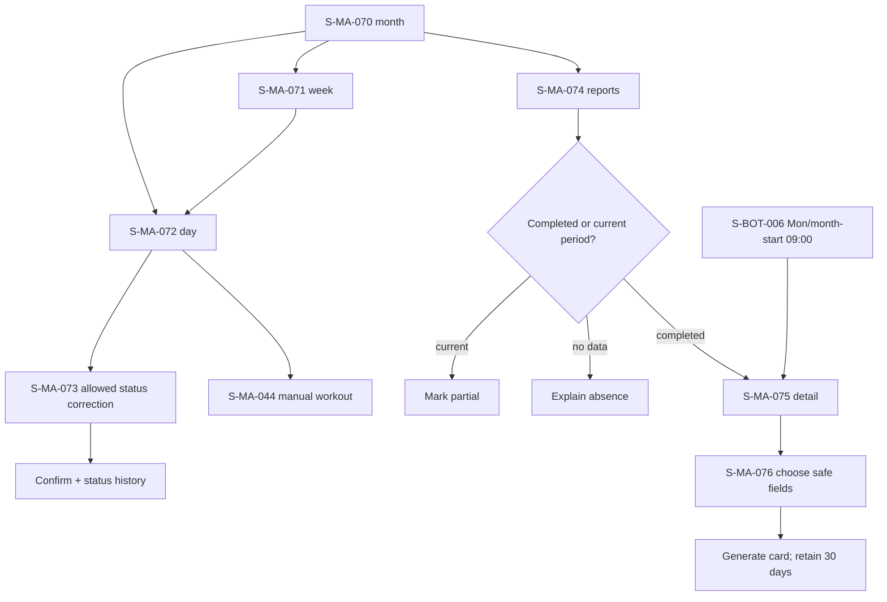

# F09 — calendar and reports

> Trace: §15, §17, §28–30; DEC-015, DEC-018.
> Canonical screen IDs: `S-MA-044`, `S-MA-070`, `S-MA-071`, `S-MA-072`, `S-MA-073`, `S-MA-074`, `S-MA-075`, `S-MA-076`, `S-BOT-006`.
> Rendered node IDs: `S-BOT-006`, `S-MA-044`, `S-MA-070`, `S-MA-071`, `S-MA-072`, `S-MA-073`, `S-MA-074`, `S-MA-075`, `S-MA-076`.

Ошибки не скрывают введённые данные; back/cancel не выполняет mutation; restricted targets повторно проверяют auth/permission. Общие состояния и accessibility: [`../screen-inventory.md`](../screen-inventory.md).
