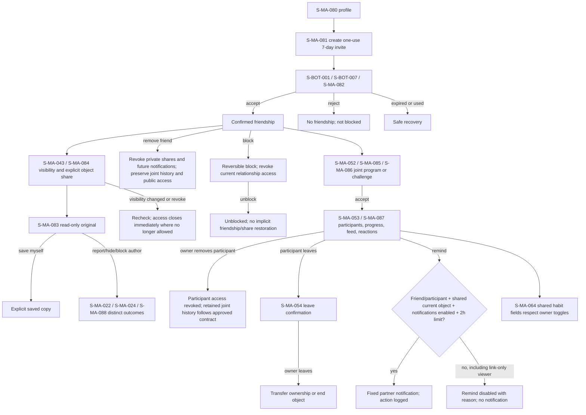

# F10 — social and sharing

> Trace: §20.6, §32–35, §37; DEC-019–021.
> Canonical screen IDs: `S-MA-022`, `S-MA-024`, `S-MA-043`, `S-MA-052`, `S-MA-053`, `S-MA-054`, `S-MA-064`, `S-MA-080`, `S-MA-081`, `S-MA-082`, `S-MA-083`, `S-MA-084`, `S-MA-085`, `S-MA-086`, `S-MA-087`, `S-MA-088`, `S-BOT-001`, `S-BOT-007`.
> Rendered node IDs: `S-BOT-001`, `S-BOT-007`, `S-MA-022`, `S-MA-024`, `S-MA-043`, `S-MA-052`, `S-MA-053`, `S-MA-054`, `S-MA-064`, `S-MA-080`, `S-MA-081`, `S-MA-082`, `S-MA-083`, `S-MA-084`, `S-MA-085`, `S-MA-086`, `S-MA-087`, `S-MA-088`.

Visibility/revoke and relationship changes recheck access immediately. `S-MA-083` never grants partner-remind merely from a link: friendship or accepted participation, a shared current object, enabled notifications and rate limit are all required. Back/cancel performs no mutation. Common states and accessibility: [`../screen-inventory.md`](../screen-inventory.md).
