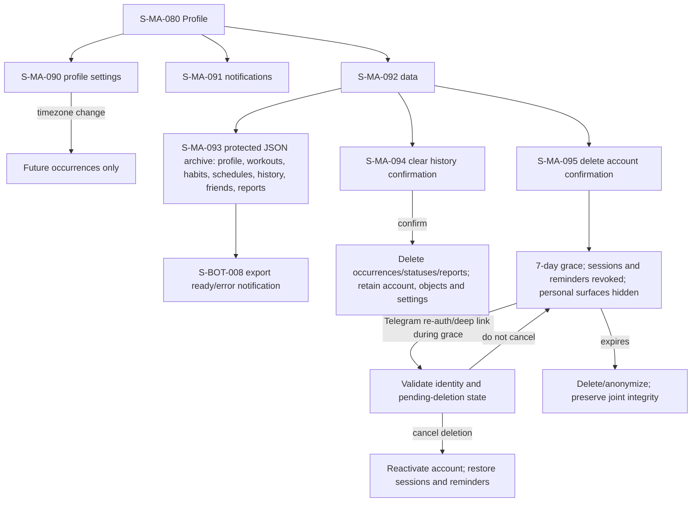

# F11 — settings, data and privacy

> Trace: §27, §38, §47, §51.2; DEC-020, DEC-022.
> Canonical screen IDs: `S-MA-080`, `S-MA-090`, `S-MA-091`, `S-MA-092`, `S-MA-093`, `S-MA-094`, `S-MA-095`, `S-BOT-008`.
> Rendered node IDs: `S-BOT-008`, `S-MA-080`, `S-MA-090`, `S-MA-091`, `S-MA-092`, `S-MA-093`, `S-MA-094`, `S-MA-095`.

Cancellation remains reachable after revocation only through validated Telegram re-auth/reactivation during the seven-day grace period. Until cancellation, normal personal access and reminders stay revoked; successful cancellation restores both sessions and reminders. Common states and accessibility: [`../screen-inventory.md`](../screen-inventory.md).
